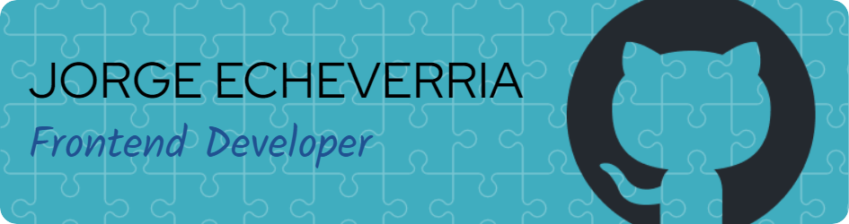

### Hello, World! My name is Jorge 👋🌏👨‍💻
- 🌱 Passionate about learning anything on React web development. The sky is the limit! 
- 👯 I enjoy collaborating with fellow developers, team work is fun work!
- 🔭 I’m currently working on a Fullstack MERN App that recognizes faces on images input by the user! 
- ⚙️ I love using HTML5, CSS3, Git, JavaScript, React (Functional components, Hooks, Custom Hooks), React Router, Bootstrap, Tailwind, Styled Components and more!

**Find me around the web... 🌐:**
<ul> 
  <li> Displaying my work on my Portfolio: https://jorgeecheverria.netlify.app/ </li>
  <li> Sharing updates on LinkedIn: https://www.linkedin.com/in/jorgee-echeverria/ </li>
  <li> Following my favorite people and reading the news on Twitter: https://twitter.com/CokoEche</li>
</ul>

---
>"First say to yourself what you would be; and then do what you have to do."
— Epictetus, Greek Stoic Philosopher
